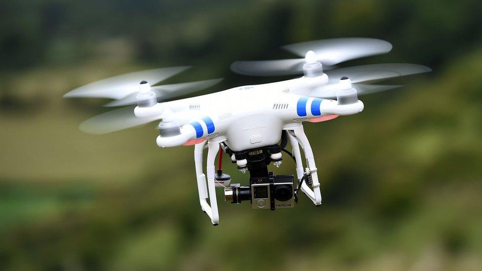
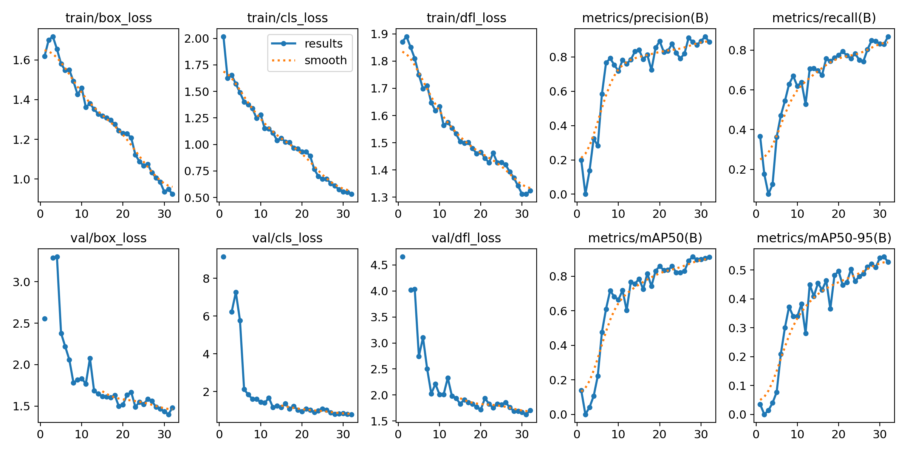
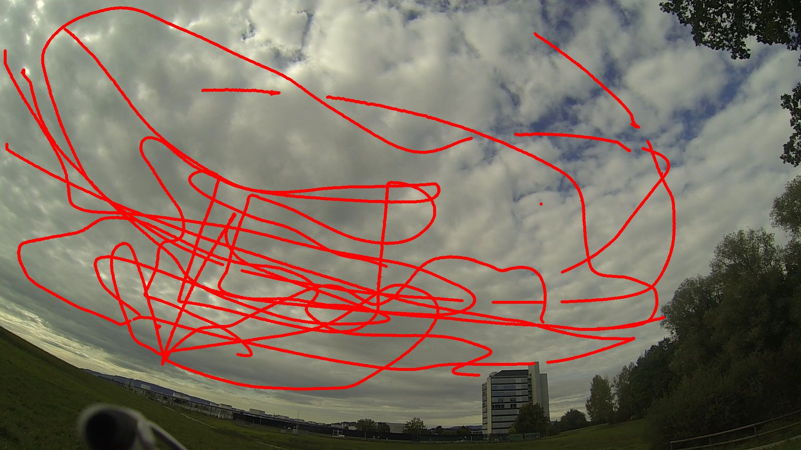

# Dynamic Real-time Adaptive Coordinates for Drone Trajectory Prediction

DRAC-Prediction is a pipeline for detecting a drone in video and predicting it's future trajectory several frames ahead. Given a detector's bounding box output, the system tracks a single target across frames, derives its center-point velocity, and feeds a short history window into a GRU-based recurrent model to forecast the drone's position at multiple future horizons (e.g. +1, +2, +4, +8, +16 frames). The system is built to be modular: any video source (webcam, file, or stream), any upstream object detector, and any trained trajectory model can be swapped independently.



> [BBC](https://www.bbc.com/news/business-35577124)

<br>

> NOTE: To run you need the models!
> Download the trained models from [this Google Drive](https://drive.google.com/drive/folders/1VB1GTvkngcJbK1OqWzLU-DrBS6yGDbos?usp=sharing) and place them in the `backend/models/` directory.

## Table of Contents

- [Demo](#demo)
- [Architecture](#architecture)
- [Dataset](#dataset)
- [Results](#results)
  - [Detection](#detection)
  - [Trajectory Prediction](#trajectory-prediction)

## Demo


## Architecture

```
Video Source (webcam / file / stream)
        |
        v
  Object Detector  -->  Single-Target Tracker  -->  Trajectory Inferencer
  (per-frame bbox)      (locks onto one drone)      (GRU: history > future positions)
```

The trajectory model (`AdaptiveTrajectoryGRU`) takes a window of the last `N` frames and outputs predicted `(x, y, vx, vy)` at each of several future horizons in a single forward pass, avoiding compounding prediction error at longer horizons.

### Formulation
 
At frame $t$, the detector + tracker produce a bounding box center position $\mathbf{p}_t = (x_t, y_t)$. Instantaneous velocity is estimated via finite differences over the frame interval $\Delta t$:
 
$$
\mathbf{v}_t = \frac{\mathbf{p}_t - \mathbf{p}_{t-1}}{\Delta t}
$$
 
The model input is a history window of the last $N$ frames, where each timestep is a state vector combining position and velocity:
 
$$
\mathbf{s}_t = (x_t,\ y_t,\ v_{x,t},\ v_{y,t}) \in \mathbb{R}^4
$$
 
$$
X_t = (\mathbf{s}_{t-N+1}, \mathbf{s}_{t-N+2}, \dots, \mathbf{s}_t) \in \mathbb{R}^{N \times 4}
$$
 
This window is passed through a GRU encoder, producing a hidden state $\mathbf{h}_t$ that summarizes recent motion:
 
$$
\mathbf{h}_t = \text{GRU}(X_t)
$$
 
Rather than autoregressively rolling the model forward one step at a time (which compounds error at each step), $\mathbf{h}_t$ is passed through a set of horizon-specific output heads, each predicting the full state directly at a fixed future offset $k \in \mathcal{K} = \{1, 2, 4, 8, 16\}$:
 
$$
\hat{\mathbf{s}}_{t+k} = f_k(\mathbf{h}_t), \quad \forall k \in \mathcal{K}
$$
 
All horizons are predicted in a single forward pass, so a bad prediction at $+1$ frame doesn't propagate into the $+16$ frame estimate.

## Dataset

Training data consists of per-frame drone center positions with timestamps, in the schema:

```
Source format (whitespace-separated, 1 header line):
    frame no.            x            y
    1.000000 654.62950739 262.89502463
    2.000000 655.02817734 263.25773399
    ...
```
And for training the detection model, we used a public dataset of drones, witch can be found [here](https://www.kaggle.com/datasets/muki2003/yolo-drone-detection-dataset).


## Results

### Detection
For detection we used a YOLOv11 model that was fine-tuned on a public drone dataset. The model achieved great performance on the validation set, with a mean average precision (mAP) of 0.85.


### Trajectory Prediction
The trajectory model was trained on a dataset of drone trajectories that looked like the image below. The model was able to predict the future positions of the drone with a training loss of 0.2103 and a validation loss of 0.4945.

